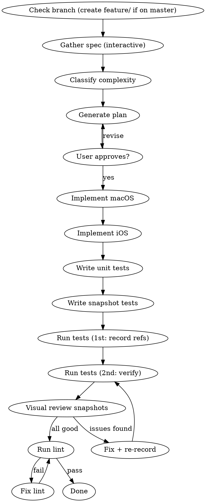

# Create Component

Create UI components for EmpDesignSystem following established patterns. Both platforms (iOS + macOS) simultaneously, with interactive spec gathering and step-by-step implementation.

**Announce:** "Using create-component skill to build a new design system component."

## Process



## Phase 0: Branch

**BEFORE any work:** check current branch with `git branch`. If on `master` — create and switch to `feature/emp-<component-name>` BEFORE making any changes.

## Phase 1: Gather Spec

Ask questions ONE AT A TIME using AskUserQuestion:

1. **Component name** — "Как назвать компонент? (EmpTextField, EmpCard, etc.)"
2. **Purpose** — "Что делает компонент? Опиши кратко."
3. **Content** — "Какой контент внутри? (текст, иконка, произвольные вью, комбинация)"
4. **Interactivity** — "Компонент интерактивный? (hover, press, disabled состояния)"
5. **Variants** — "Есть ли визуальные варианты? (стили, цветовые схемы)"
6. **Sizes** — "Нужны ли размеры? (small, medium, large)"

Stop asking when you have enough to classify complexity.

## Phase 2: Classify Complexity

Based on answers, pick the tier:

| Tier | Example | ControlParameter | Content | Preset | Files per platform |
|------|---------|-------------------|---------|--------|--------------------|
| **Simple** | EmpLabel, EmpDivider | No | No | No | 2 (Component, Preview) |
| **Interactive** | EmpButton, EmpToggle | Yes | Yes | Yes | 5+ (Component, ViewModel, Content, Preset, Preview) |

**Simple** = no state changes, no hover/press, single visual variant.
**Interactive** = has states (hover, press, disabled) OR multiple visual variants with Preset.

## Phase 3: Plan

Present the plan listing ALL files to create:

```
macOS:
  EmpUI_macOS/Sources/Components/EmpX.swift
  EmpUI_macOS/Sources/Components/EmpX+ViewModel.swift        (interactive only)
  EmpUI_macOS/Sources/Components/EmpX+Content.swift           (interactive only)
  EmpUI_macOS/Sources/Components/EmpX+Preset.swift            (interactive only)
  EmpUI_macOS/Sources/Preview/EmpX+Preview.swift
  EmpUI_macOS/Tests/EmpXTests.swift
  EmpUI_macOS/Tests/EmpXSnapshotTests.swift

iOS:
  EmpUI_iOS/Sources/Components/EmpX.swift
  EmpUI_iOS/Sources/Components/EmpX+ViewModel.swift           (interactive only)
  EmpUI_iOS/Sources/Components/EmpX+Content.swift              (interactive only)
  EmpUI_iOS/Sources/Components/EmpX+Preset.swift               (interactive only)
  EmpUI_iOS/Sources/Preview/EmpX+Preview.swift
  EmpUI_iOS/Tests/EmpXTests.swift
  EmpUI_iOS/Tests/EmpXSnapshotTests.swift
```

Get user approval before writing code.

## Phase 4: Implement

Order: **macOS first, then iOS.** For each platform, follow this order:

1. **ViewModel** (if interactive) — data structure
2. **Content** (if interactive) — content element definitions
3. **Component class** — the NSView/UIView subclass
4. **Preset** (if interactive) — factory methods
5. **Preview** — #Preview macros with examples
6. **Unit tests** — ViewModel, Content, Preset logic

After implementation: `mise exec -- tuist generate --no-open` then build both platforms.

## Phase 5: Snapshot Tests

Write snapshot tests for BOTH platforms. See `./patterns.md` → "Snapshot Test Pattern" for templates.

**Interactive components:**
- Parameterized `@Test(arguments:)` covering ALL preset combinations (style × color × size)
- Separate tests for content variants: icon+text, text+icon, icon-only
- Disabled state test

**Simple components:**
- One snapshot per visual configuration (each init parameter combination that affects appearance)

**Running snapshots (per platform):**
1. `mise exec -- tuist test EmpUI_macOS` — 1st run records references, tests FAIL (expected)
2. `mise exec -- tuist test EmpUI_macOS` — 2nd run compares to references, tests PASS
3. Repeat for `EmpUI_iOS`

## Phase 6: Visual Review

**MANDATORY: Read every generated PNG snapshot using the Read tool.** Check for:

- [ ] Text not truncated (no "..." or clipping)
- [ ] Icons visible and correctly sized
- [ ] Padding/margins look correct (content not touching edges)
- [ ] Corner radius matches the style
- [ ] Colors match the style (filled = inverted text on action bg, ghost = transparent bg, etc.)
- [ ] Disabled state is visually distinct (semi-transparent)
- [ ] Outlined style has visible border

**If issues found:**
1. Fix the component source code
2. Delete ALL snapshots: `rm -f EmpUI_<platform>/Tests/__Snapshots__/EmpXSnapshotTests/*.png`
3. Re-run tests twice (record + verify)
4. Re-read PNGs to confirm fix

Repeat until ALL snapshots look correct.

After visual review: `swiftformat . && swiftlint`.

## Mandatory Rules

Read `./patterns.md` for code templates before writing ANY code. Every line of generated code MUST follow these rules:

- **ViewModel** MUST have `common` as first field
- **configure(with:)** MUST call `apply(common:)` first
- **Content** constrained to `layoutMarginsGuide` (iOS) / `empLayoutMarginsGuide` (macOS)
- **One file = one type.** Nested types in `+NestedType.swift`
- **Colors** from `NSColor.Semantic` / `UIColor.Semantic` only. NEVER hardcode hex
- **Spacing** via `EmpSpacing` tokens only
- **#Preview** — use `let _ =` for configure calls, NO explicit `return`
- **Tests** — Swift Testing, `@Test("описание на русском")`, `#expect` / `#require`
- **Snapshot tests** — swift-snapshot-testing, `.image(size:)` strategy, ALL presets covered
- **macOS NSTextField** — use `setContentCompressionResistancePriority(999, .horizontal)` instead of `lineBreakMode = .byTruncatingTail` (AppKit bug: truncation mode breaks intrinsic content size)
- **Visual review** — MUST read every snapshot PNG after generation and verify correctness
- **SwiftLint clean** — switch cases on newline, lines <= 140 chars
- **NEVER commit** — user reviews and commits

## Red Flags

| Thought | Stop |
|---------|------|
| "Skip iOS, just do macOS" | Both platforms always |
| "Hardcode this color" | Use Semantic palette |
| "Skip Preset for this button variant" | Interactive = Preset required |
| "Put nested type in same file" | Separate file always |
| "Use layoutMargins directly on macOS" | Use empLayoutMarginsGuide |
| "Skip tests, it's simple" | Tests always required |
| "Skip snapshot tests" | Snapshots always required |
| "Skip visual review, tests pass" | MUST read PNGs and verify visually |
| "Use lineBreakMode .byTruncatingTail on macOS" | Use compression resistance 999 instead |
| "Snapshots failed on 1st run = bug" | 1st run records refs, failure expected |
| "Work directly on master" | ALWAYS create feature/ branch first |
