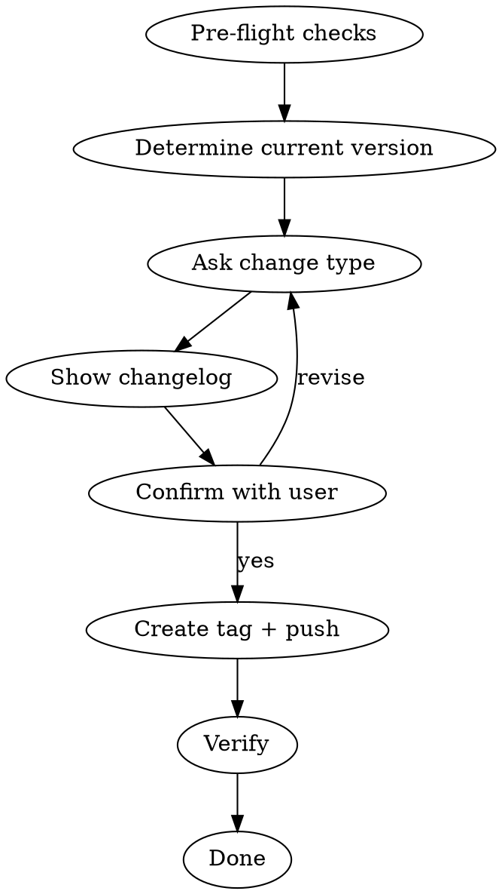

# Release

Выпуск новой версии библиотеки EmpDesignSystem через git-теги и семантическое версионирование.

**Announce:** "Using release skill to publish a new version of EmpDesignSystem."

## Process



## Phase 1: Pre-flight Checks

Run ALL checks before proceeding. **Fail fast** — if any check fails, stop and tell the user what to fix.

```bash
# 1. Must be on master
git branch --show-current
# Expected: master

# 2. Working tree must be clean
git status --porcelain
# Expected: empty output

# 3. Must be up to date with remote
git fetch origin
git status -sb
# Expected: no "ahead" or "behind"
```

| Check | Failed | Action |
|-------|--------|--------|
| Not on master | `git checkout master` or merge feature branch first | Tell user to merge feature branch |
| Dirty working tree | Uncommitted changes exist | Tell user to commit or stash |
| Behind remote | `origin/master` has newer commits | Tell user to `git pull` |
| Ahead of remote | Local commits not pushed | Tell user to `git push` first |

**ALL checks must pass before continuing.**

## Phase 2: Determine Current Version

```bash
# Get latest tag (semver sorted)
git tag -l --sort=-v:refname | head -1
```

- If no tags exist → current version is `0.0.0`, next will be first release
- Parse tag as `MAJOR.MINOR.PATCH`

## Phase 3: Ask Change Type

Use AskUserQuestion with these options:

**Question:** "Какой тип изменений в этом релизе?"

| Option | Description | Example |
|--------|-------------|---------|
| **Patch** (x.x.+1) | Баг-фикс, мелкие правки. API не изменился. | 1.0.0 → 1.0.1 |
| **Minor** (x.+1.0) | Новый компонент, новые параметры. Старый код работает. | 1.0.0 → 1.1.0 |
| **Major** (+1.0.0) | Удаление/переименование API. Старый код сломается. | 1.0.0 → 2.0.0 |

Calculate the new version number based on the choice.

## Phase 4: Show Changelog

Show the user what's included in this release:

```bash
# If tags exist — diff from last tag
git log <last-tag>..HEAD --oneline --no-decorate

# If no tags — all commits
git log --oneline --no-decorate
```

Present to user:

```
Релиз: <current> → <new version>

Изменения:
- <commit 1>
- <commit 2>
- ...

Подтвердить?
```

Use AskUserQuestion to confirm. Options: "Да, создать тег" / "Изменить тип версии" / "Отмена".

## Phase 5: Create Tag + Push

```bash
# Create annotated tag
git tag -a <version> -m "Release <version>"

# Push tag to origin
git push origin <version>

# Ensure master is pushed too
git push origin master
```

## Phase 6: Verify

```bash
# Verify tag exists on remote
git ls-remote --tags origin | grep <version>
```

Report to user:

```
Версия <version> опубликована!

Потребители получат обновление при:
- Xcode: File > Packages > Update to Latest Package Versions
- SPM CLI: swift package update
- Tuist: tuist install
```

## Semantic Versioning Rules

| Тип | Когда | Пример |
|-----|-------|--------|
| **Patch** | Баг-фикс, правка документации, внутренний рефакторинг | Исправили cornerRadius в EmpButton |
| **Minor** | Новый компонент, новые параметры в ViewModel, новые цвета | Добавили EmpProgressBar |
| **Major** | Удалили компонент, переименовали метод, изменили сигнатуру configure | Переименовали `apply(common:)` |

## Red Flags

| Thought | Stop |
|---------|------|
| "Release from feature branch" | ONLY release from master |
| "Skip pushing tag" | Tag MUST be on remote for SPM |
| "Use lightweight tag" | ALWAYS use annotated tags (`-a`) |
| "Delete/move existing tag" | NEVER — breaks SPM cache for consumers |
| "Push without confirming version" | ALWAYS confirm with user before creating tag |
| "Skip changelog" | User needs to see what's included |
